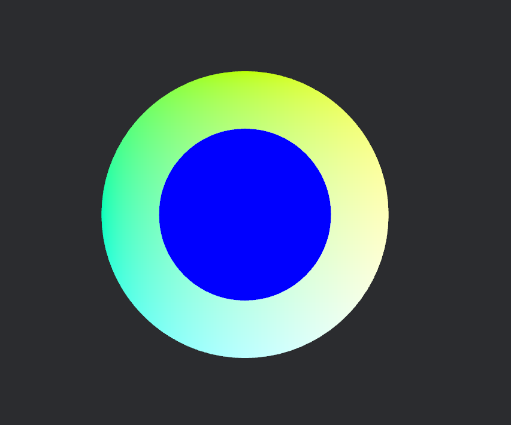

# bevy_prototype_lyon + Custom Shader

This is a simple example project that shows how a custom shader can be used alongside [bevy_prototype_lyon](https://github.com/Nilirad/bevy_prototype_lyon).

There are basically two things you need to do to get any meteral/texture to work:
  - Avoid `ColorMateral` being added as a required component.
  - Add UVs to the mesh.

Works with `bevy_prototype_lyon` v0.13.0 but at time of writing changes in the master brach would force `ColorMaterial` to be used.

This is cobbled together from various examples scattered about the web, with thanks to the writers of the following:
- [webgpufundamentals: WGSL](https://webgpufundamentals.org/webgpu/lessons/webgpu-wgsl.html)
- [Bevy Examples: Shader Material](https://bevyengine.org/examples/shaders/shader-material-2d/)
- [Bevy Examples: Generate Custom Mesh](https://bevyengine.org/examples/3d-rendering/generate-custom-mesh/)
- [How to render a shader outline for a 2d mesh?](https://github.com/bevyengine/bevy/discussions/7102) - Never got an answer but the code given was helpful in working out how to set uvs.
- [bevy_prototype_lyon: plugin.rs](https://github.com/Nilirad/bevy_prototype_lyon/blob/v0.13.0/src/plugin.rs)
- [Bevy's color material shader](https://github.com/bevyengine/bevy/blob/release-0.15.3/crates/bevy_sprite/src/mesh2d/color_material.wgsl)

